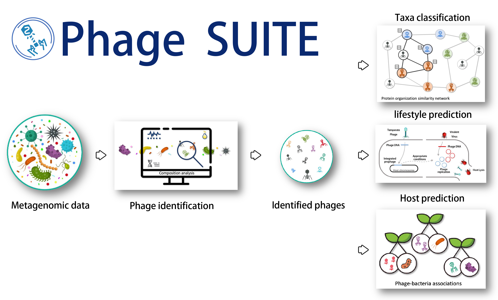

# [PhaBOX](https://phage.ee.cityu.edu.hk) Webserver


This is the source code of our website [Phage BOX](https://phage.ee.cityu.edu.hk). Please note that this stand-alone version is only available on Linux systems.

Phage BOX is a Python library for phage-related tasks: 
1. phage identification
2. taxonomy classification
3. host prediction
4. lifestyle prediction. 


We integrate our previously published tools: PhaMer, PhaGCN, CHERRY, and PhaTYP, into one program. In addition, we optimized the functions in these programs to save computation resources and time and provided a one-shot mode to run all the pipelines using one command.  Hope you will enjoy it.


If you have any suggestions or problems, feel free to contact me via email: jyshang2-c@my.cityu.edu.hk. Also, you can open an issue under this GitHub folder.

## Latest update:
1. If you want to predict the phage-bacteria interaction using your own bacterial assemblies, please try: https://github.com/KennthShang/CHERRY_MAGs
2. If you want to predict the host range (multiple hosts) of your phages, please try: https://github.com/KennthShang/CHERRY_crispr_multihost

# Overview


## Required Dependencies
Detailed package information can be found in `webserver.yaml`

If you want to use the GPU to accelerate the program, please install the packages below:
* cuda
* Pytorch-gpu

Search [pytorch](https://pytorch.org/) to find the correct Cuda version based on your computer


## Quick install
*Note*: we suggest you install all the packages using conda (both [miniconda](https://docs.conda.io/en/latest/miniconda.html) and [Anaconda](https://anaconda.org/) are ok).

After cloning this repository, you can use conda to install the **webserver.yml**. This will install all packages you need with CPU mode. The command is: `conda env create -f webserver.yml -n phabox`


### Prepare the database and environment
Due to the limited size of GitHub, we zip the database. Before using phabox, you need to unpack them using the following commands.

1. When you use PhaBOX for the first time
```
cd PhaBOX/
conda env create -f webserver.yml -n phabox
conda activate phabox


# database
pip install gdown
gdown  --id 1hjACPsIOqqcS5emGaduYvYrCzrIpt2_9

# initial files
gdown  --id 1E94ii3Q0O8ZBm7UsyDT_n06YekNtfV20

unzip phagesuite_database.zip  > /dev/null
unzip phagesuite_parameters.zip  > /dev/null

# move the script to where the conda located
cp blastxml_to_tabular.py {path_to_conda}/envs/phabox/bin/blastxml_to_tabular.py
chmod 777 {path_to_conda}/envs/phabox/bin/blastxml_to_tabular.py

# example
cp blastxml_to_tabular.py ~/miniconda3/envs/phabox/bin/blastxml_to_tabular.py
chmod 777 ~/miniconda3/envs/phabox/bin/blastxml_to_tabular.py
```


2. Then, you only need to activate your 'phabox' environment before using phabox in the next time.
```
conda activate phabox
```

**Notice:** If you are in Mainland China, please use VPN to download the file or you can try Baidu Cloud via the link below:

```
Link: https://pan.baidu.com/s/18gx_p-Y4g22W5LcXvIyO_A pwd: uran
Link: https://pan.baidu.com/s/1QJQAIr89xbt4e3pJr_QhaQ pwd: 2gjb
```
## Usage 

### Run all pipelines in one command:

```
python main.py [--contigs INPUT_FA] [--threads NUM_THREAD][--len MINIMUM_LEN] [--rootpth ROOT_PTH] [--out OUTPUT_PTH]  [--midfolder MID_PTH] [--parampth PARAM_PTH] [--dbdir DR]
```

**Options**


      --contigs INPUT_FA
                            input fasta file
      --threads NUM_THREAD
                            Number of threads to run PhaMer (default 8)
      --len MINIMUM_LEN
                            predict only for sequence >= len bp (default 3000)                                                                                                                                                                                                                                                                                                                                                                                                                                                                                                                                                                                                                                                                                                                                                                                                                                                                                                                                                                                                                                                                                                                                                                                                                                                                                                                                                                                                                                                                                                                                                                                                                                                                                                                                                                                                                                                                                                                                                                                                                                                                                                                                                                                                                                                                                                                                                                                                                                                                                                                                                                                                                                                                                                                                                                                                                                                                                                                                                                                                                                                                                                                                                                                                                                                                                                                                                                                                                                                                                                                                                                                                                                                                                                                                                                                                                                                                                                                                                                                                                                                                                                                                                                                                                                                                                                                                                                                                                                                                                                                                                                                                                                                                                                                                                                                                                                                                                                                                                                                                                                                                                                                                                                                                                                                                                                                                                                                                                                                                                                                                                                                                                                                                                                                                                                                                                                                                                                                                                                                                                                                                                                                                                                                                                                                                                                                                                                                                                                                                                                                                                                                                                                                                                                                   
      --rootpth ROOT_PTH
                            The folder you want to store the outputs of PhaBOX (default user_0/)
      --out OUTPUT_PTH
                            The output folder under rootpth. All the prediction will be stored in this folder. (default out/)
      --midfolder MID_PTH
                            The midfolder under rootpth. All the intermediate files will be stored in this folder. (default midfolder/)
      --parampth PARAM_PTH 
                            The pth you store your parameters (default parameters/)
      --scriptpth PARAM_PTH 
                            The pth you store your scripts (default scripts/)
      --dbdir DR
                            An optional path to store the database directory (default database/)


**Example**

Prediction on the example file:

    python main.py --contigs test_contigs.fa --threads 8 --len 3000 --rootpth simple_test --out out/ --dbdir database/ --parampth parameters/ --scriptpth scripts/

Then, Phage BOX will run all the sub-functions to generate predictions under the `simple_test/out/` foder:  `phamer_prediction.csv` (phage identification), `phagcn_prediction.csv` (taxonomy classification), `cherry_prediction.csv` (host prediction), and `phatyp_prediction.csv` (lifestyle prediction). 


### Run pipeline seperately:

The only difference between running all pipelines and running single pipelines is the name of the file. Below are the examples:

```
# run PhaMer
python PhaMer_single.py --contigs test_contigs.fa --threads 8 --len 3000 --rootpth simple_test --out out/ --dbdir database/ --parampth parameters/ --scriptpth scripts/

# run PhaTYP
python PhaTYP_single.py --contigs test_contigs.fa --threads 8 --len 3000 --rootpth simple_test --out out/ --dbdir database/ --parampth parameters/ --scriptpth scripts/

# run PhaGCN
python PhaGCN_single.py --contigs test_contigs.fa --threads 8 --len 3000 --rootpth simple_test --out out/ --dbdir database/ --parampth parameters/ --scriptpth scripts/

# run CHERRY
python Cherry_single.py --contigs test_contigs.fa --threads 8 --len 3000 --rootpth simple_test --out out/ --dbdir database/ --parampth parameters/ --scriptpth scripts/
```


## Running Phage BOX as a binary file

We are sorry that Phage BOX currently do not support to run as an env in conda. However, you can still add the path of the *.py files to your system path and run them as binary files:

```
export PATH="{path of the *py files}:$PATH"
```

However, if you do not want to revise the system path, you can run Phage BOX by passing absolute path. For example, if you placed PhaBOX/ folder under your home path (home/PhaBOX/) and your database and parameters are store under PhaBOX/ (home/PhaBOX/database/ and home/PhaBOX/parameters/), then you can run the command line as below:

```
python ~/PhaBOX/main.py --contigs {where your fasta file located} --threads 8 --len 3000 --rootpth {where you want to store the result} --out out/ --dbdir ~/PhaBOX/database/ --parampth ~/PhaBOX/parameters/ --scriptpth ~/PhaBOX/scripts/

#example
python home/PhaBOX/main.py --contigs /computenodes/node35/team3/my_contigs.fasta --threads 8 --len 3000 --rootpth home/my_contigs_result/ --out out/ --dbdir home/PhaBOX/database/ --parampth home/PhaBOX/parameters/ --scriptpth home/PhaBOX/scripts/
```

### Note

If you did not move **blastxml_to_tabular.py** to your conda env as introduced in the **Prepare the database and environment** section, you can use the parameter *--script* to pass a path of the folder.
```
python ~/PhaBOX/main.py --contigs {where your fasta file located} --threads 8 --len 3000 --rootpth {where you want to store the result} --out out/ --dbdir ~/PhaBOX/database/ --parampth ~/PhaBOX/parameters/ --scripts ~/PhaBOX/scripts

#example
python home/PhaBOX/main.py --contigs /computenodes/node35/team3/my_contigs.fasta --threads 8 --len 3000 --rootpth home/my_contigs_result/ --out out/ --dbdir home/PhaBOX/database/ --parampth home/PhaBOX/parameters/ --scripts home/PhaBOX/scripts
```

### Output format

The explanation of the output format can be found via: [PhaBOX Example Result](https://phage.ee.cityu.edu.hk/example_result#part1)


**Note for the prediction of CHERRY (host prediction part)** -- released on July 17th, 2023

The current taxonomy is based on the NCBI RefSeq; if you want to use the GTDB version, we provide a script (in the GTDB folder) to convert.
```
python convert_refseq_gtdb.py --infile [PATH_TO_'cherry_prediction.csv']
```

### Contact

If you have any questions, please email us: jyshang2-c@my.cityu.edu.hk


# Citations

If you use PhaBOX for your research, please use the citations listed below. 

* PhaBOX (Whole pipeline)

```
Jiayu Shang, Cheng Peng, Herui Liao, Xubo Tang, Yanni Sun, PhaBOX: a web server for identifying and characterizing phage contigs in metagenomic data, Bioinformatics Advances, Volume 3, Issue 1, 2023, vbad101, https://doi.org/10.1093/bioadv/vbad101
```
* PhaMer (phage identification)

```
Jiayu Shang, Xubo Tang, Ruocheng Guo, Yanni Sun, Accurate identification of bacteriophages from metagenomic data using Transformer, Briefings in Bioinformatics, 2022;, bbac258, https://doi.org/10.1093/bib/bbac258
```

* PhaGCN (taxonomy classification)

```
Jiayu Shang, Jingzhe Jiang, Yanni Sun, Bacteriophage classification for assembled contigs using graph convolutional network, Bioinformatics, Volume 37, Issue Supplement_1, July 2021, Pages i25–i33, https://doi.org/10.1093/bioinformatics/btab293
```

* Cherry (host prediction)

```
Jiayu Shang, Yanni Sun, CHERRY: a Computational metHod for accuratE pRediction of virus–pRokarYotic interactions using a graph encoder–decoder model, Briefings in Bioinformatics, 2022;, bbac182, https://doi.org/10.1093/bib/bbac182
```

* PhaTYP (Lifestyle prediction)

```
Jiayu Shang, Xubo Tang, Yanni Sun, PhaTYP: predicting the lifestyle for bacteriophages using BERT, Briefings in Bioinformatics, 2022;, bbac487, https://doi.org/10.1093/bib/bbac487
```

### Possible Issues (updated by July 17th 2023)
1. Inputs should be in FASTA format.
2. The contigs' accession should begin with a letter. Only number (such as >1, >2, >3) is not allowed.
3. Special characters such as '|', '~', '&', '$', ':', and '/' are not allowed in the contigs' accession/ID/name.
4. The sequences should be made up of CAPITAL LETTERS.
5. It is recommended to only input phage contigs when using PhaGCN, PhaTYP and CHERRY.


## Update log
* Oct. 23th 2023: Currently, if CHERRY finds the CRISPRs match of the input phages, CHERRY will no longer call the model-predict function for host prediction.
* Oct. 25th 2023: According to our experimental results, to maintain the best precision, we revised the threshold for CRISPRs alignment to be: coverage > 0.95 and identity > 95
