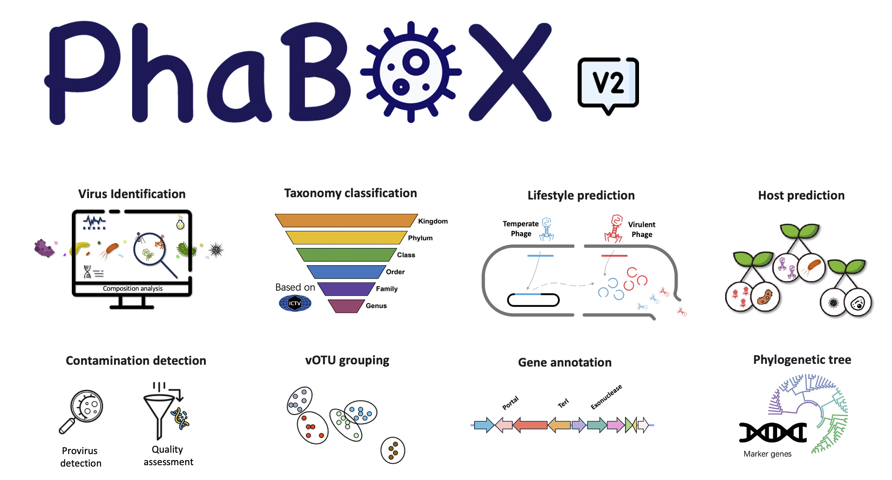

# Local version of [PhaBOX2](https://phage.ee.cityu.edu.hk) web server

 

This is the source code of our website [PhaBOX2](https://phage.ee.cityu.edu.hk). 

For large-scale sequencing data, please download this local version and use more threads to speed up the program.

## ⌛️&nbsp; News

PhaBOX has now been upgraded to the 2.0 version with faster speed!

There are some major components, including:

  🎉 Generalized for all kinds of viruses; more than just bacteriophage

  🎉 Virus identification (PhaMer)

  🎉 Taxonomy classification (PhaGCN)

  🎉 Host prediction (CHERRY/HostG)

  🎉 Lifestyle prediction (PhaTYP)

  🎉 Contamination/provirus detection

  🎉 vOTU grouping

  🎉 Phylogenetic tree based on marker genes

  🎉 Viral protein annotation

  🎉 All the databases are updated to the latest ICTV 2024 release

If you have any more suggestions, feel free to let me know! We consider long-term maintenance PhaBOX and adding modules according to your needs

You can post an issue or directly email me (jiayushang@cuhk.edu.hk). We welcome any suggestions.

## 🚀&nbsp; Quick Start
> [!IMPORTANT]
> If you are a new user, please check our [WIKI](https://github.com/KennthShang/PhaBOX/wiki) page. We provide a tutorial to help you get started quickly and understand how to use PhaBOX2. We hope you will enjoy it!
>
> If you only want to analyze the results for Bacteriophages (as version 1), please check the **Prokarytic viruses** columns in the PhaGCN's results.

If you are familiar with the PhaBOX2, please check our [Update log](https://github.com/KennthShang/PhaBOX/wiki/Update-logs). We may have some updates to the program to make it more useful. If you want to use the latest version, please also [upgrade your PhaBOX2](https://github.com/KennthShang/PhaBOX/wiki#upgrading-phabox)

## 📘&nbsp; License
The PhaBOX pipelines are released under the terms of the [Academic Free License v3.0 License](https://choosealicense.com/licenses/afl-3.0/).

