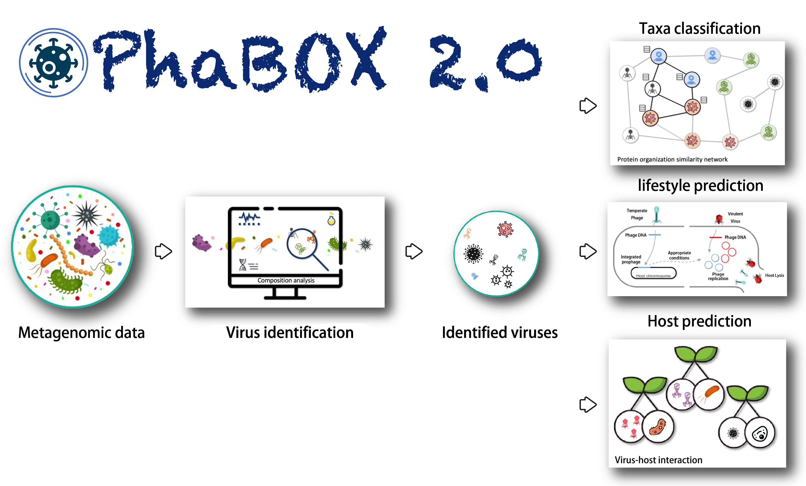

# Local version of [PhaBOX2](https://phage.ee.cityu.edu.hk) web server

This is the source code of our website [PhaBOX2](https://phage.ee.cityu.edu.hk). Please note that this stand-alone version is only available on Linux systems.

PhaBOX2 is a Python library for virus-related tasks: 
1. virus identification
2. taxonomy classification
3. host prediction
4. lifestyle prediction (for prokaryotic virus). 

Table of Contents
=================
* [ ⌛️&nbsp; News](#news)
* [ 🚀&nbsp; Quick Start](#quick)
* [ 📫&nbsp; Have a question? ](#question)
* [ ✏️&nbsp; Citation ](#citation)
* [ ⌛️&nbsp; License ](#license)
* [ 🤵&nbsp; Team ](#team)


<a name="news"></a>
## ⌛️&nbsp; News

PhaBOX has now been upgraded to the 2.0 version!!! There are some major components, including:

1. Generalize for all kinds of viruses with faster speed! But we will call it PhaBOX2, not VirBOX, for a better inheritance ：) 
2. Provide a more comprehensive taxonomy classification (latest ICTV 2024) and complete taxonomy lineage
3. Provide a genus-level clustering for potential new genus (genus-level vOTU)!
4. Provide a protein annotation function!
5. Provide a contamination and prophage detection module!
6. More user-friendly commands!

The web server is still upgrading; please be patient

The following functions will be coming soon!
1. Provide a marker-searching module for the phylogenetic tree
2. Allowing the use of the host prediction function in a more flexible way (only use CRISPRs for prediction; MAGs' CRISPR detection, etc.). Currently, if you want to predict the phage-bacteria interaction via CRISPR using **your own bacterial assemblies**, please try: [https://github.com/KennthShang/CHERRY_crispr_MAG](https://github.com/KennthShang/CHERRY_crispr_MAG)

If you have further suggestions, feel free to let me know! You can post an issue or directly email me (jiayushang@cuhk.edu.hk). We welcome any suggestions.


## 🚀&nbsp; Quick Start
Please check our [WIKI](https://github.com/KennthShang/PhaBOX/wiki) page! We also provide a Tutorial for you to quickly get started and understand the usage of phabox2. Hope you will enjoy it!


<a name="citation"></a>
## ✏️&nbsp; Citation

The PhaBOX2 have not been formally published. But if you use PhaBOX for your research, feel free to use the citations listed below:

* PhaBOX (Whole pipeline)

```
Jiayu Shang, Cheng Peng, Herui Liao, Xubo Tang, Yanni Sun, PhaBOX: a web server for identifying and characterizing phage contigs in metagenomic data, Bioinformatics Advances, Volume 3, Issue 1, 2023, vbad101, https://doi.org/10.1093/bioadv/vbad101
```

Since we integrate our previously published tools: [PhaMer](https://academic.oup.com/bib/article/23/4/bbac258/6620872), [PhaGCN](https://academic.oup.com/bioinformatics/article/37/Supplement_1/i25/6319660), [CHERRY](https://academic.oup.com/bib/article/23/5/bbac182/6589865), and [PhaTYP](https://academic.oup.com/bib/article/24/1/bbac487/6842869), into the program. You can also cite them as below:

* PhaMer (phage identification)

```
Jiayu Shang, Xubo Tang, Ruocheng Guo, Yanni Sun, Accurate identification of bacteriophages from metagenomic data using Transformer, Briefings in Bioinformatics, 2022;, bbac258, https://doi.org/10.1093/bib/bbac258
```

* PhaGCN (taxonomy classification)

```
Jiayu Shang, Jingzhe Jiang, Yanni Sun, Bacteriophage classification for assembled contigs using graph convolutional network, Bioinformatics, Volume 37, Issue Supplement_1, July 2021, Pages i25–i33, https://doi.org/10.1093/bioinformatics/btab293
```

* Cherry (host prediction)

```
Jiayu Shang, Yanni Sun, CHERRY: a Computational metHod for accuratE pRediction of virus–pRokarYotic interactions using a graph encoder–decoder model, Briefings in Bioinformatics, 2022;, bbac182, https://doi.org/10.1093/bib/bbac182
```

* PhaTYP (Lifestyle prediction)

```
Jiayu Shang, Xubo Tang, Yanni Sun, PhaTYP: predicting the lifestyle for bacteriophages using BERT, Briefings in Bioinformatics, 2022;, bbac487, https://doi.org/10.1093/bib/bbac487
```

If you used the contamination module, please also cite:
```
Nayfach, S., Camargo, A. P., Schulz, F., Eloe-Fadrosh, E., Roux, S., & Kyrpides, N. C. (2021). CheckV assesses the quality and completeness of metagenome-assembled viral genomes. Nature biotechnology, 39(5), 578-585.
```


<a name="license"></a>

## 📘&nbsp; License
The PhaBOX pipelines are released under the terms of the [Academic Free License v3.0 License](https://choosealicense.com/licenses/afl-3.0/).


<a name="team"></a>
## 🤵&nbsp; Team

 * <b>Head of PhaBOX program</b><br/>

 | [Jiayu SHANG](https://kennthshang.github.io/)       | [Cheng PENG](https://github.com/ChengPENG-wolf)       |
|:-------------------------:|:-------------------------:|
|  |  |


 * <b>Supervisor</b><br/>
 
 | [Yanni SUN](https://yannisun.github.io/)       |
|:-------------------------:|
|  |


Our groupmates also provide many useful tools for bioinformatics analysis. Please check [Yanni's Group](https://yannisun.github.io/tools.html) for further information. Hope you will like them! 
