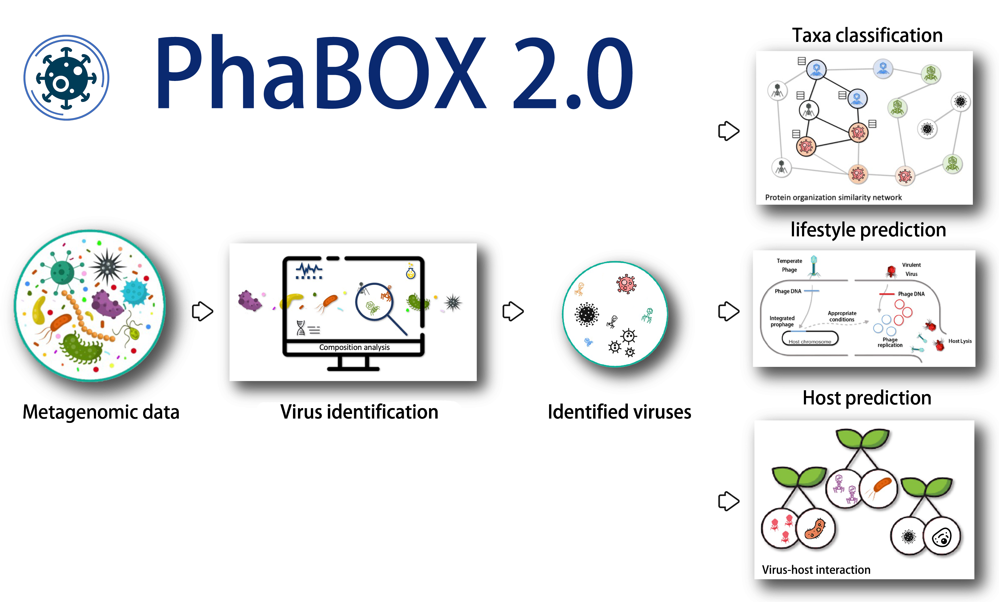

# Local version of [PhaBOX2](https://phage.ee.cityu.edu.hk) web server

This is the source code of our website [PhaBOX2](https://phage.ee.cityu.edu.hk).

PhaBOX2 is a Python library for virus-related tasks: 
1. virus identification
2. taxonomy classification
3. host prediction
4. lifestyle prediction (for prokaryotic virus). 

Table of Contents
=================
* [ ⌛️&nbsp; News](#news)
* [ 🚀&nbsp; Quick Start](#quick)
* [ ⌛️&nbsp; License ](#license)
* [ 🤵&nbsp; Team ](#team)

## ⌛️&nbsp; News

PhaBOX has now been upgraded to the 2.0 version, which is generalized for all kinds of viruses with faster speed!!! 

There are some major components, including:

  🎉 Virus identification

  🎉 Taxonomy classification

  🎉 Host prediction

  🎉 Lifestyle prediction

  🎉 Contamination/provirus detection

  🎉 vOTU grouping

  🎉 Phylogenetic tree based on marker genes

  🎉 Viral protein annotation

  🎉 All the databases are updated to the latest ICTV 2024 release

If you have any more suggestions, feel free to let me know! We consider long-term maintenance PhaBOX and adding modules according to your needs

You can post an issue or directly email me (jiayushang@cuhk.edu.hk). We welcome any suggestions.

## 🚀&nbsp; Quick Start

### Please check our [WIKI](https://github.com/KennthShang/PhaBOX/wiki) page. We provide a tutorial to help you get started quickly and understand how to use PhaBOX2. We hope you will enjoy it!

## 📘&nbsp; License
The PhaBOX pipelines are released under the terms of the [Academic Free License v3.0 License](https://choosealicense.com/licenses/afl-3.0/).
