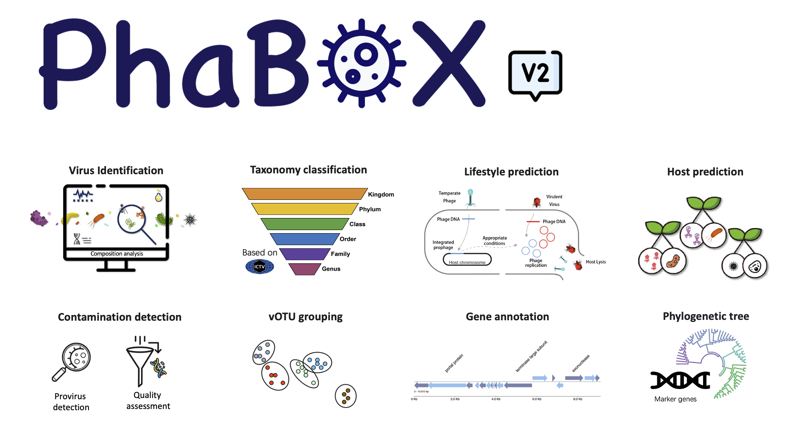

# Local version of [PhaBOX2](https://phage.ee.cityu.edu.hk) web server

This is the source code of our website [PhaBOX2](https://phage.ee.cityu.edu.hk).

PhaBOX2 is a Python library for virus-related tasks: 
1. virus identification
2. taxonomy classification
3. host prediction
4. lifestyle prediction (for prokaryotic virus). 

Table of Contents
=================
* [ ⌛️&nbsp; News](#news)
* [ 🚀&nbsp; Quick Start](#quick)
* [ ⌛️&nbsp; License ](#license)
* [ 🤵&nbsp; Team ](#team)

## ⌛️&nbsp; News

PhaBOX has now been upgraded to the 2.0 version!!! There are some major components, including:

  🎉 Generalize for all kinds of viruses with faster speed! But we will call it PhaBOX2, not VirBOX, for a better inheritance ：) 

  🎉 Provide a more comprehensive taxonomy classification (latest ICTV 2024) and complete taxonomy lineage

  🎉 Provide a genus-level clustering for potential new genera (genus-level vOTU)!

  🎉 Provide a protein annotation function!

  🎉 Provide a contamination and prophage detection module!

  🎉 Allowing to predict host using your bacterial MAGs

  🎉 Provide a vOTU grouping module

  🎉 Provide a marker-searching module for the phylogenetic tree

  🎉 More user-friendly commands!

If you have further suggestions, feel free to let me know! You can post an issue or directly email me (jiayushang@cuhk.edu.hk). We welcome any suggestions.

## 🚀&nbsp; Quick Start

### Please check our [WIKI](https://github.com/KennthShang/PhaBOX/wiki) page. We provide a tutorial for you to get started quickly and understand the usage of phabox2. Hope you will enjoy it!

## 📘&nbsp; License
The PhaBOX pipelines are released under the terms of the [Academic Free License v3.0 License](https://choosealicense.com/licenses/afl-3.0/).
